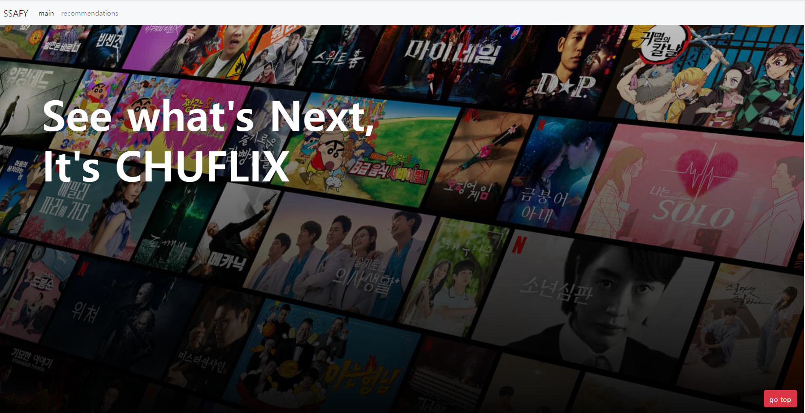
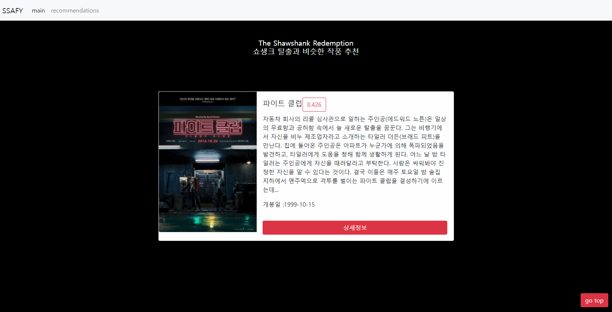
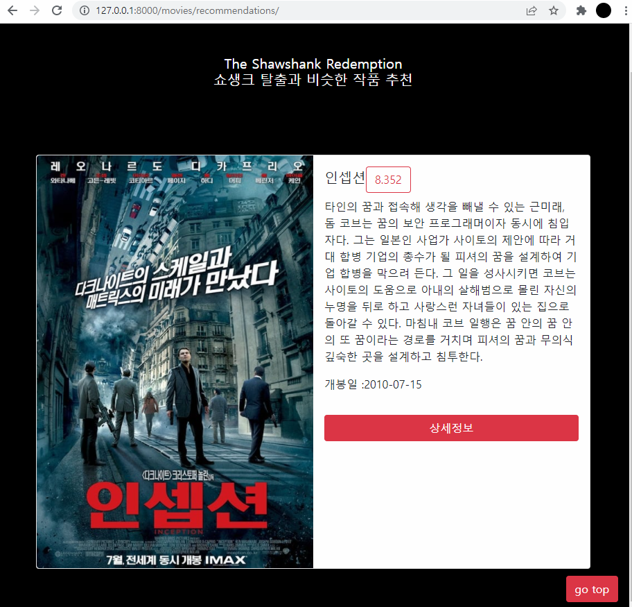
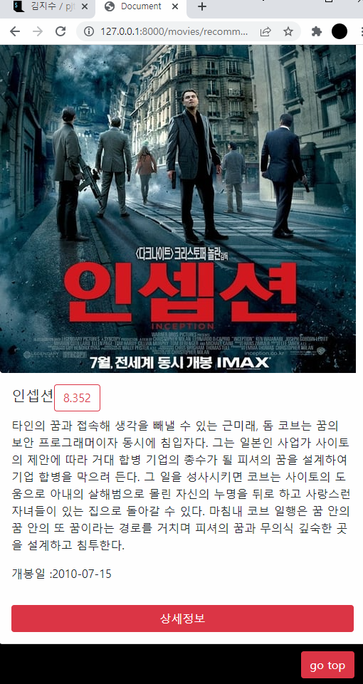
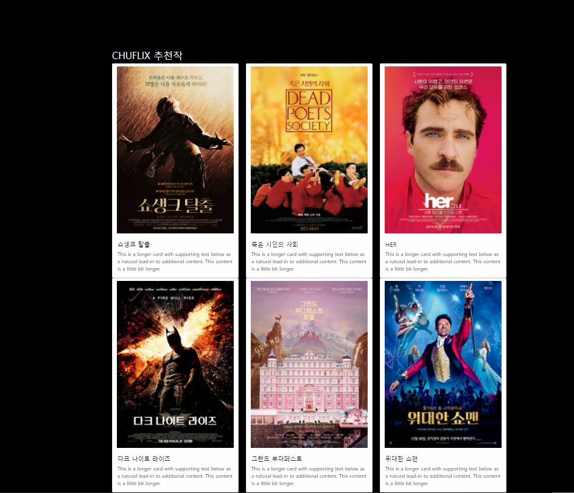
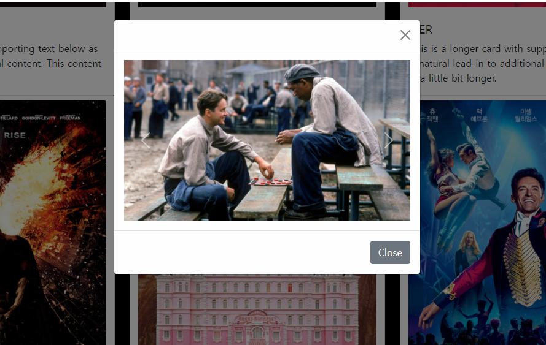

```
1. 그리드 카드 만들고 > 그안에 모달 넣고 > 그안에 캐러셀 넣는거 고민하다가 시간이 다 간거같다.. 부트스트랩 코드를 자유자재로 사용 할 수 있도록 연습이 필요할 거 같다.. 
2. html, css 파일로 작성하는 것과 base.url 상속 받아서 하는게 달라서 다루기가 어렵다(?) index 헤드부분에 추가하고 싶은 css가 있었는데 recommendation도 상속받으니까 어떻게 해야 할지 모르겠어서(시간도 부족하고) 일단 pass 다음에 한번 해 봐야겠다
3. 아직도 django는 어렵다! 네브바에 main/reco 버튼에 name설정 안하고 url을 집어 넣어서 했더니 url에 movie/movie 이런식으로 중복돼서 오류가 떳다. 인호님과 다같이 고민 해 보았으나 결국 교수님께 도움을 요청했다.. 
4. static이미지 <<<<<<< 까먹고 이미지 상대경로 넣었다가 자꾸 오류가 발생했다
5. api요청해서 html파일로 넘기는게 어렵다! 추천영화페이지 제작을 하려는데 id를 기반으로 추천하는 거라.. id는 어떻게 가져오며 그걸 어떻게 랜덤으로 추출해서 다시 화면에 보이게 해야하는지 ㅠ 너무 어렵다
---------------------------------------------------------------
* 열심히 수정 했으나.. 추천영화페이지 그리드에서 버튼이 md일때 안내려가는 현상발생
* tmdb 사이트 들어가서 쇼생크 탈출 검색하면 url에 movie id값이 뜬다!
* 개별 html파일에 css 적용하는 방법
1. settings.py에 추가
STATIC_URL = '/static/'

STATICFILES_DIRS = (
    os.path.join(BASE_DIR, 'static'),
 
2. base.html <head>부분에 추가
  
  
  
3.html 파일에 추가


<link rel="stylesheet" href="">

  
웹은 정말 재밌어!
```












